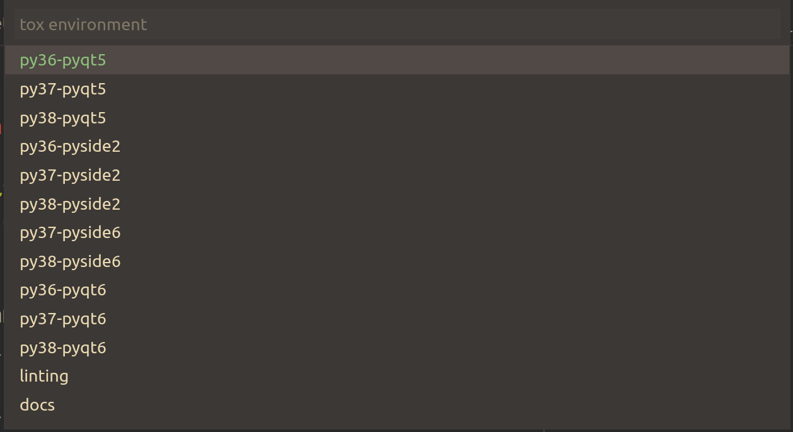

# python-tox extension for Visual Studio Code

<a href="https://tox.readthedocs.io">
    
    
</a>


[](https://marketplace.visualstudio.com/items?itemName=the-compiler.python-tox)
[](https://marketplace.visualstudio.com/items?itemName=the-compiler.python-tox)
[](https://marketplace.visualstudio.com/items?itemName=the-compiler.python-tox)

[](https://open-vsx.org/extension/the-compiler/python-tox)
[](https://open-vsx.org/extension/the-compiler/python-tox)
[](https://open-vsx.org/extension/the-compiler/python-tox)

[](https://github.com/The-Compiler/vscode-python-tox/actions/workflows/ci.yml)
[](https://github.com/sponsors/The-Compiler/)

This extension integrates the [tox](https://tox.readthedocs.io/) task automation tool with Visual Studio Code.



## Here be dragons

**Note:** The extension was mainly written to scratch my own itch, and this is
the first time I'm writing something "real" using TypeScript and NodeJS.

Contributions, suggestions and improvements of all kinds are very welcome,
but use at your own risk.

## Installing

- Install the extension via the [Visual Studio
Marketplace](https://marketplace.visualstudio.com/items?itemName=the-compiler.python-tox)
or the [Open VSX
Registry](https://open-vsx.org/extension/the-compiler/python-tox)

- make sure that [tox](https://github.com/tox-dev/tox) is installed.

- finally, run one of the [commands](#extension-commands) via the command palette
or bind them to a shortcut. No default shortcuts are provided.

For [VSpaceCode](https://vspacecode.github.io/), consider a configuration such as:

```jsonc
    "vspacecode.bindingOverrides": [
        {
            "keys": ["m", "languageId:python", "c", "t"],
            "name": "+Tox",
            "icon": "play",
            "type": "bindings",
            "bindings": [
                {
                    "key": "t",
                    "name": "Run tox",
                    "icon": "play",
                    "type": "command",
                    "command": "python-tox.select"
                },
                {
                    "key": "T",
                    "name": "Run tox with arguments",
                    "icon": "play-circle",
                    "type": "command",
                    "command": "python-tox.selectWithArgs"
                },
                {
                    "key": "m",
                    "name": "Run tox (multiple)",
                    "icon": "run-all",
                    "type": "command",
                    "command": "python-tox.selectMultiple"
                },
                {
                    "key": "M",
                    "name": "Run tox (multiple) with arguments",
                    "icon": "run-all",
                    "type": "command",
                    "command": "python-tox.selectMultipleWithArgs"
                },
                {
                    "key": "?",
                    "name": "Show tox documentation",
                    "icon": "book",
                    "type": "command",
                    "command": "python-tox.openDocs"
                }
            ]
        },
        // ...
    ]
```

To get a development build of the latest commit, you can:

- Go to the [GitHub Actions tab](https://github.com/The-Compiler/vscode-python-tox/actions/workflows/ci.yml),
  view the newest passing run and download an automated build from the "Artifacts" section.
- Or clone the repository and run `npm run package`

Then install the resulting `.vsix` file using the command palette and selecting
"Extensions: Install from VSIX...".

## Extension Commands

- `python-tox.select`: Show a menu allowing to pick a tox environment.
- `python-tox.selectWithArgs`: Show a menu allowing to pick a tox environment, then ask for custom arguments.
- `python-tox.selectMultiple`: Show a menu allowing to pick multiple tox environments.
- `python-tox.selectMultipleWithArgs`: Show a menu allowing to pick multiple tox environments, then ask for custom arguments.
- `python-tox.openDocs`: Open the tox documentation in the web browser.

## Suggested extensions

- [Ini for VSCode](https://marketplace.visualstudio.com/items?itemName=DavidWang.ini-for-vscode) for simpler navigation of large `tox.ini` files.

## Release Notes

See [CHANGELOG.md](CHANGELOG.md).

## Releasing checklist

- Double-check the CI
- `npm version <major|minor|patch>`
- `git push origin`
- `git push origin vX.Y.Z`
- Lean back and let the CI do the rest
