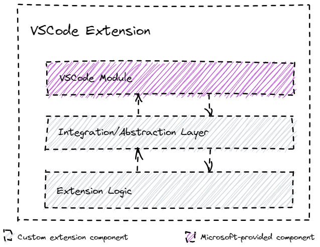

# VSCode Integration Layer

## Overview

In order to improve the extension's testability and maintainability, VSCode logic is accessible via a thin abstraction/integration layer. Additionally dependency injection is used to avoid strong coupling between the extension code and the vscode module (simplifies writing unit tests).

## Details

The abstraction/integration layer code is stored under `./src/abstraction`. As of today, the code is organized based on the relevant vscode module namespaces (e.g. `vscode.window`, `vscode.workspace`, etc).
